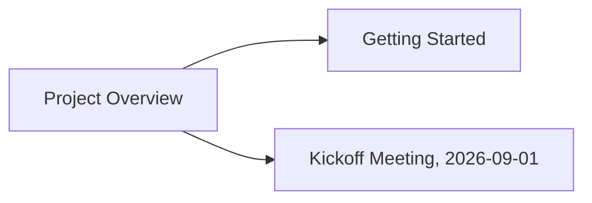

# Org Mode & Roam

Vix speaks a pragmatic subset of [Org mode](https://orgmode.org/) — headline
outlines, TODO states, checkboxes, tags, tables, and a column-view
spreadsheet overlay — plus an [Org-roam](https://www.orgroam.com/)-style
layer on top: networked notes with stable IDs, `[[id:...][Title]]` links,
backlinks, a node graph, and a daily-notes journal. This tutorial works
through both using the demo workspace's real Org files.

For the quick-reference version of each feature see
[`docs/org/index.md`](../../org/index.md) and
[`docs/roam/index.md`](../../roam/index.md); this page goes deeper, with a
worked example at every step. The full specs are
`crates/vix-org/spec/index.md`, `crates/vix-org-table/spec/index.md`,
`crates/vix-column-view/spec/index.md`, `crates/vix-org-capture/spec/index.md`,
and `crates/vix-roam/spec/index.md`.

Open the demo workspace:

```sh
cd examples/demo-workspace
vix .
```

Its `org/` directory has four files this tutorial uses directly:

| File | What it is |
| --- | --- |
| `org/roam/project-overview.org` | The anchor node — links out to the other two. |
| `org/roam/getting-started.org` | A checklist node, linked back from the overview. |
| `org/roam/meeting-2026-09-01.org` | A meeting-note node with headlines, TODO/DONE items, and action items. |
| `org/dailies/2026-09-13.org` | A daily note linking into all three roam nodes above. |

## Headline structure

Open `org/roam/meeting-2026-09-01.org`. It's a normal Org outline: one or
more leading `*` marks a headline, and everything until the next headline of
the same or shallower level is its subtree.

```
* Attendees
* Notes
* Action items
** TODO Add a total-word-count line to the Rust output
** TODO Validate the CSV before averaging scores in the Python script
```

Put the cursor on `* Action items` and open the **Org** menu (`Alt+O`):

- **New Heading** (`org.new_heading`) inserts a sibling headline below the
  cursor, at the same level.
- **Edit Structure → Promote** / **Demote** (`org.promote` / `org.demote`)
  add or remove one `*` across the whole subtree — put the cursor on one of
  the `** TODO` action items and Demote it to `***` to see the two items
  keep the same relationship to `* Action items`.
- **Edit Structure → Move Subtree Up** / **Move Subtree Down** swap a
  subtree with its sibling; the cursor follows.
- **Navigate Headings → Previous/Next Heading** (`org.nav.previous` /
  `org.nav.next`) steps between headlines at any level; **Previous/Next Same
  Level** (`org.nav.backward` / `org.nav.forward`) stays within siblings.
- **Show/Hide → Cycle Visibility (Fold)** folds or unfolds the section under
  the cursor; **Overview (Fold All)** collapses the whole buffer to just its
  headlines.

Undo (`Ctrl+Z`, or whatever your keymap binds) puts anything you just tried
back the way it was — these examples are meant to be typed and undone as you
go.

## TODO states and checkboxes

Put the cursor on either `** TODO` action item and run **Cycle TODO**
(`org.cycle_todo`, `C-c C-t` in the Emacs keymap): it steps
`TODO → DONE → (no keyword) → TODO`. Under the **Notes** headline, the same
file already has one of each:

```
- TODO Follow up with Carol about the CSV data source
- DONE Set up the repo layout
```

**Mark Done with Note…** (`org.close_note`, the `C-u C-c C-t` universal-argument
variant in Emacs) marks a headline `DONE`, stamps a `CLOSED: [now]` line under
it, and logs the note you type into a `:LOGBOOK:` drawer.

Now open `org/roam/getting-started.org` — its checklist is plain checkbox
items, not headlines:

```
- [ ] Open =rust-app/src/main.rs= and resolve the TODO/FIXME comments.
- [ ] Open =scripts/hello.py= and do the same.
- [ ] Send the request in =api.http= and read the response tab.
- [ ] Open =db/demo.sqlite= in the DB workbench and run a query against it.
- [ ] Run the "test" task from Tools -> Tasks... (defined in =tasks.toml=).
```

(The `=...=` pairs are Org's verbatim-text markers — one of six emphasis
markers under **Editing → Emphasis** that wrap a selection: bold `*`, italic
`/`, underline `_`, code `~`, verbatim `=`, strikethrough `+`.)

Put the cursor on one of the `- [ ]` lines and run **Toggle Checkbox**
(`org.toggle_checkbox`) to flip it to `- [x]`. If a parent line carries a
statistics cookie — `[/]` (fraction) or `[%]` (percent) — it updates
automatically on every checkbox toggle or TODO cycle, or on demand via
**Update Statistics** (`org.update_statistics`). Try it: add `[/]` to the
checklist's title line —

```
A short checklist for a first pass through the demo workspace: [/]
```

— then toggle a couple of the boxes below it and watch the cookie fill in as
`[2/5]`.

**Refresh Context** (`org.ctrl_c_ctrl_c`, Emacs `C-c C-c`) is the general
context action: on a checkbox line it toggles the box; anywhere else it
recomputes statistics cookies.

## Tags and properties

Every roam node in this workspace already carries file-level tags via a
`#+filetags:` line — `project-overview.org` has `#+filetags: :demo:project:`,
`meeting-2026-09-01.org` has `#+filetags: :demo:meeting:`. A headline can
carry its own trailing `:tag:tag:` group the same way. With the cursor on a
headline, **Tags & Properties → Set Tags…** (`org.set_tags`, `C-c C-q`)
prompts, pre-filled with the headline's current tags, and replaces the
group; **Set Property…** (`org.set_property`) prompts for `NAME VALUE` and
writes it into the headline's `:PROPERTIES:` drawer (creating the drawer if
needed) — this is how the `:ID:` property at the top of every roam node file
got there in the first place.

With the cursor on a `:PROPERTIES:` header line (like the one at the top of
`meeting-2026-09-01.org`), **Tab** folds the drawer's body behind a trailing
`…`; **Tab** again unfolds it.

## Tables

Org's pipe-table editor (`vix-org-table`) isn't used by any of the demo
workspace's `.org` files, so try it in a scratch buffer or at the bottom of
`meeting-2026-09-01.org`. Type a delimiter-free start and let **Tab** build
the table:

```
| Name | Role |
| Alice | Engineer |
| Bob | Designer |
```

With the cursor inside it, **Org → Table → Align** (`org.table.align`,
`C-c C-c`) re-renders every column to its widest cell, right-aligning
numeric columns:

```
| Name  | Role      |
|-------+-----------|
| Alice | Engineer  |
| Bob   | Designer  |
```

`Tab`/`Shift-Tab` move field-to-field (realigning first, and appending a row
if you `Tab` past the last field); `S-<up/down/left/right>` swap a field
with its neighbor. **Org → Table → Insert Hline Below** (`C-c -`) adds the
`|---+---|` rule; **Insert Row Above** / **Delete Row** / **Move Row Up/Down**
and their column equivalents (`Org → Table`, `M-S-<arrow>` / `M-<arrow>`)
restructure the table. **Sort Rows…** (`org.table.sort`, `C-c ^`) sorts the
data rows by a chosen column.

A `#+TBLFM:` line right below a table adds spreadsheet formulas. Add a
`Score` column and a formula row:

```
| Name  | Score | Double |
|-------+-------+--------|
| Alice |    10 |        |
| Bob   |     7 |        |
#+TBLFM: $3=$2*2
```

Run **Align** (`C-c C-c`, which also recalculates `#+TBLFM:` on a table
line) and the `Double` column fills in `20` / `14`. `@ROW$COL=<expr>`
targets one field instead of a whole column; `vsum`/`vmean`/`vmin`/`vmax`/
`vcount` take a `@R$C..@R2$C2` range. See `crates/vix-org-table/spec/index.md`
for the full formula language and the rectangle copy/cut/paste commands
(`Org → Table → Rectangle`).

## Column view

Column View (`Org → Tags & Properties → Column View → Turn On`,
`org.column_view`, Emacs `C-c C-x C-c`) overlays the whole outline as a live,
editable spreadsheet — one row per headline, one column per property. With
no `#+COLUMNS:` line or `:COLUMNS:` property anywhere, it falls back to the
built-in default spec `%ITEM %TODO %PRIORITY %TAGS`, which is exactly the
case in `meeting-2026-09-01.org` — open it there and turn Column View on
anywhere in the buffer. You'll see one row per headline (`Attendees`,
`Notes`, `Action items`, and its two `TODO` children), with `ITEM` showing
each headline's text indented by level and `TODO` showing `TODO` where set.

Inside the overlay:

- `↑`/`↓`/`←`/`→` moves the selected cell.
- `n` / `p` (or `Shift+→` / `Shift+←`) cycles the `TODO` cell through the
  keyword list, or any other cell through its column's allowed-value list.
- `e` edits a cell's raw text; `Enter` commits.
- `v` shows a cell's full value on the status line (useful for a cell
  narrower than its content).
- `<` / `>` narrows / widens the current column.
- `q` / `Esc` closes the overlay.

Every edit applies straight through to the real buffer text as you make it —
there's no separate save step for the overlay itself (saving the file to
disk still works the normal way). Add a `:COLUMNS:` property to the
`Action items` headline's drawer to scope a custom spec to just that
subtree, e.g. `:COLUMNS: %40ITEM %TODO %EFFORT{:}` to also show and roll up
an `EFFORT` property — see `crates/vix-org/spec/index.md` § Column view for
the full `#+COLUMNS:`/`:COLUMNS:` syntax, summary types (`+`, `min`/`max`/
`mean`, `X`/`X/`/`X%`, `:`, …), and the dynamic-block `columnview` capture
(`Org → Tags & Properties → Column View → Dynamic Block`). The interactive
overlay's own key list and design are in `crates/vix-column-view/spec/index.md`.

## Capture templates

**Org → Capture** is template-driven, in the shape of Emacs `org-capture`:
named templates with `%^{Prompt}`-style placeholders, wrapped as a headline/
item/checkbox/table-row, and filed at a target. Five built-in templates ship
by default, each its own menu item:

| Item | Key | What it does |
| --- | --- | --- |
| Anything… | `a` | Prompt for a task, insert `* TODO <task>`. |
| Task… | `t` | Multiline review buffer pre-filled `* TODO `. |
| Note… | `n` | Prompt for note text, insert `* <note>` plus a `%U` timestamp. |
| Babel… | `b` | Prompt for a language, open a `#+begin_src <language>` / `#+end_src` block for review. |
| Contact… | `c` | Prompt for Name/Email/Phone/Address/Birthday, insert an org-contacts entry. |

Try **Org → Capture → Anything…** (`org.capture`) with the cursor anywhere
in `meeting-2026-09-01.org`'s **Action items** subtree — it inserts a new
`* TODO` sibling right there. **Choose Template…** (`org.capture.select`)
opens a chooser listing every configured template, built-in or custom — it's
where you reach anything added to the `org_capture_templates` setting beyond
the five built-ins. A template can
target more than the cursor: `id:<ID>` (a node's `:ID:` property — the same
IDs the roam nodes below use), `file:<path>`, `file+headline:<path>#Head`,
or `file+datetree:<path>`. Placeholders cover today's/an inactive timestamp
(`%t`/`%u`), a link back to the capture site (`%a`), the clipboard (`%c`),
and more — the full placeholder table and target syntax is in
`crates/vix-org-capture/spec/index.md`.

## Org-roam: nodes and links

A **node** is an `.org` file with an `:ID:` property and a `#+title:`; nodes
link to each other with `[[id:<id>][Title]]` links. Open
`org/roam/project-overview.org`:

```
:PROPERTIES:
:ID:       9c1a1e2e-3b4f-4a9d-8b1c-1f2e3a4b5c6d
:END:
#+title: Project Overview
#+filetags: :demo:project:

This is the anchor node for the demo workspace tour. [...]

- [[id:eaf9904b-ef0b-4078-9dd4-a7557375ea56][Getting Started]] -- what to try first.
- [[id:3d8e5f6a-7b8c-4d9e-af01-2b3c4d5e6f70][Kickoff Meeting, 2026-09-01]] -- where the action items below came from.
```

Its `:ID:` (`9c1a1e2e-…`) is what the other two nodes link back to; its two
`[[id:...][...]]` lines point at `getting-started.org`'s and
`meeting-2026-09-01.org`'s own IDs. Put the cursor anywhere inside one of
those `[[id:...]]` links and run **Org → Hyperlinks → Follow Link**
(`org.link.follow`, `C-c C-o`): Vix scans the project's `.org` files for the
matching `:ID:` property and opens that file. Follow the "Getting Started"
link to land in `getting-started.org`, whose own first line —
`Linked from [[id:9c1a1e2e-...][Project Overview]].` — links right back.

Other node commands, all under **Org → Roam** (or the equivalent leaves
under **Org → Node**, which shares the same underlying `:ID:`-based node
model):

- **Find Node…** (`roam.node_find`) prompts for a title and opens the
  matching node, or creates `<slug>.org` with a fresh `:ID:` if none exists.
- **Insert Node Link…** (`roam.node_insert`) prompts for a title and inserts
  an `[[id:...][Title]]` link at the cursor, finding or creating the target
  node without leaving the buffer you're in.
- **Random Node** (`roam.node_random`) jumps to a random node.
- **Capture Node…** (`roam.capture`) prompts for a title and creates/opens a
  node — useful when you just want a new node, not a link to one.

Typing `[[` directly in an Org buffer also opens a completion popup of node
titles — accepting one inserts the link and closes it (`]]`) for you; see
`crates/vix-roam/spec/wiki-link-completion/index.md`.

## Backlinks

With the cursor in `project-overview.org`, run **Org → Roam → Backlinks**
(`roam.backlinks`). It opens a buffer of *linked* references — every node
whose `[[id:...]]` points at this one's `:ID:` — plus *unlinked* references,
files that mention its title in plain text without a link. Open
`getting-started.org` or `meeting-2026-09-01.org` instead and run Backlinks
there: both list `project-overview.org` as a linked reference, since both
are linked *from* it (the relationship recorded at the other end).

**Org → Roam → Live Backlinks** (`roam.backlinks_follow`) is the toggle
version — turn it on once and the bottom dock keeps a live backlinks view
for whichever node buffer you're currently in, refreshing as you switch
between `project-overview.org`, `getting-started.org`, and
`meeting-2026-09-01.org`.

## The node graph

**Org → Roam → Graph** (`roam.graph`) compiles every node and every
`[[id:...]]` link between them into a Mermaid `flowchart` in a new buffer.
Run it from anywhere in the demo workspace and you'll get a three-node graph
matching the links above — `Project Overview` pointing at both `Getting
Started` and `Kickoff Meeting, 2026-09-01`:



(Vix renders the buffer as Mermaid *source* text, not a live diagram — paste
it somewhere that renders Mermaid, or read the shape directly.) **Org →
Roam → Sync Database** (`roam.db_sync`) re-scans the project's `.org` files
and opens a sortable table of every node's title, file, and tags — there's
no persistent database to go stale; it's a stateless re-scan every time,
matching org-roam's own `org-roam-db-sync` semantics.

## Dailies

`org/dailies/2026-09-13.org` is a daily note — one file per day, under a
`daily/`-style directory, distinct from a single growing datetree file. It
links right back into today's tour:

```
* 09:00 Start the demo workspace tour

Opened [[id:9c1a1e2e-3b4f-4a9d-8b1c-1f2e3a4b5c6d][Project Overview]] and worked through the checklist in
[[id:eaf9904b-ef0b-4078-9dd4-a7557375ea56][Getting Started]].

* 10:30 Notes

Fixed the =word_counts= lowercasing bug in =rust-app/src/main.rs= -- one of
the action items from [[id:3d8e5f6a-7b8c-4d9e-af01-2b3c4d5e6f70][Kickoff Meeting, 2026-09-01]].
```

**Org → Roam → Dailies → Today** (`roam.dailies_today`) opens (creating if
needed) *today's* note — on any day other than 2026-09-13 that's a different,
empty file, not this one. To revisit this specific date, use **Dailies → Go
to Date…** (`roam.dailies_date`) and type `2026-09-13`. **Dailies → Capture
Today…** (`roam.dailies_capture`) appends a fresh `* HH:MM …` entry to
today's note, the same shape as the two entries above.

**Dailies → Calendar…** (`roam.dailies_calendar`) opens the month-grid
calendar in dailies mode: navigate to September 2026 and press Enter on the
13th — instead of inserting a date string (the calendar's normal behavior
elsewhere in Vix), Enter opens this exact daily note. See
`crates/vix-roam/spec/dailies-calendar/index.md`.

## Where to go next

- `crates/vix-org/spec/index.md` — the full action table, Emacs chord list,
  agenda views, and the column-view engine.
- `crates/vix-org-table/spec/index.md` — every table command, including
  rectangle copy/cut/paste and the full `#+TBLFM:` formula language.
- `crates/vix-org-capture/spec/index.md` — every placeholder, target, and
  entry type a capture template can use.
- `crates/vix-roam/spec/index.md` and its sub-specs
  (`crates/vix-roam/spec/dailies-calendar/index.md`,
  `crates/vix-roam/spec/live-backlinks/index.md`,
  `crates/vix-roam/spec/wiki-link-completion/index.md`) — the roam layer in
  full, including `Org → Node`'s org-node-style operations (Nodeify Entry,
  Extract Subtree to Node, List Dead Links) not covered above.
- [`docs/org/index.md`](../../org/index.md) and
  [`docs/roam/index.md`](../../roam/index.md) — the quick-reference pages
  this tutorial expands on.

---

**Previous:** [05 — Setting Up LSP](../05-setting-up-lsp/index.md)
**Next:** [07 — The DB Workbench](../07-the-db-workbench/index.md)

---

Vix™ and Vix IDE™ are trademarks.
